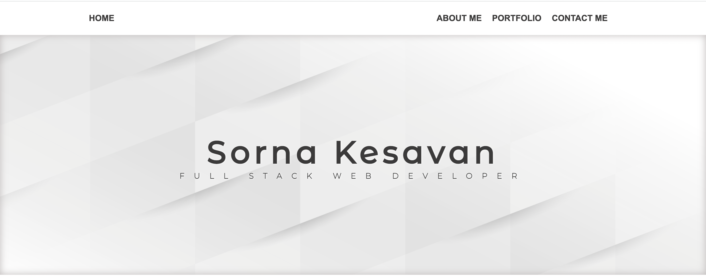

# My_Portfolio

### URL : https://alsornak.github.io/updated-portfolio/

## Task

```md
I am updating my portfolio page and other materials to build toward being employer-competitive.This site will run in the browser and feature dynamically updated HTML and CSS.
```

## Table of Contents
- [Requirements](#requirements)

- [Mock-Up](#mock-up)

- [Built With](#built-with)

- [Contributors](#contributors)


## Requirements
```md
* Updated portfolio featuring Project 1 and two exemplary homework assignments.

* Updated GitHub profile with pinned repositories featuring Project 1 and two exemplary assignments.

* Updated resume which has a link to a downloadable PDF.

* Updated LinkedIn profile.
```

## Mock-Up



## Built With

```md
* HTML
* CSS
* Animate.css
* Font Awesome
```

## Contributors
Sorna Kesavan ©2022 All Rights Reserved.